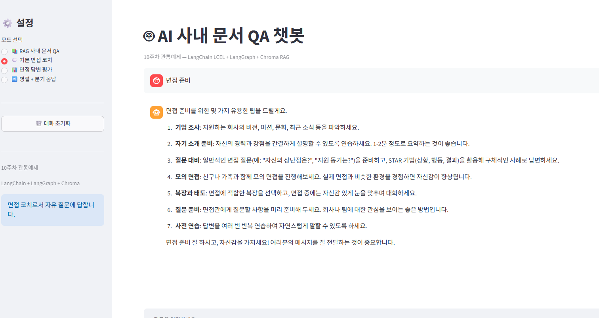
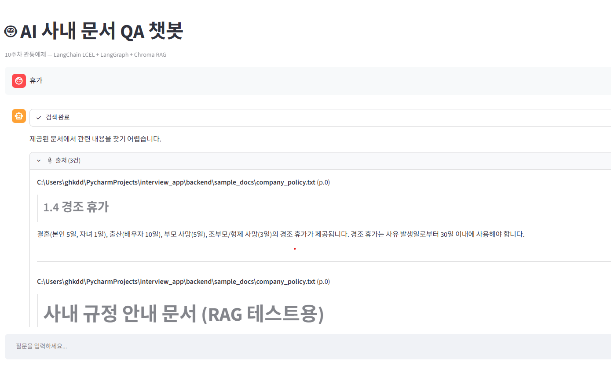

internal-qa

question
휴가

attempts
0

docs
`[]`

quality
{}

route_log
[]
Output

Markdown
Fields

answer
제공된 문서에서 관련 내용을 찾기 어렵습니다.

question
휴가

attempts
0

docs

0

id
37830ffb-ec5c-4581-ba06-522cf68a0ef8

page_content
### 1.4 경조 휴가 결혼(본인 5일, 자녀 1일), 출산(배우자 10일), 부모 사망(5일), 조부모/형제 사망(3일)의 경조 휴가가 제공됩니다. 경조 휴가는 사유 발생일로부터 30일 이내에 사용해야 합니다. ## 2. 출장 규정 ### 2.1 출장비 한도 국내 출장비 한도는 일비 2만원, 숙박비 10만원(서울 기준), 교통비 실비 정산입니다. 해외 출장은 지역별 차등 적용되며, 미주/유럽 지역은 일비 50달러, 아시아 지역은 일비 40달러입니다. ### 2.2 출장 신청 절차 출장 신청은 출장 시작 5영업일 전까지 그룹웨어에서 출장 신청서를 제출합니다. 해외 출장은 10영업일 전까지 신청해야 하며, 부서장과 본부장 2단계 승인이 필요합니다. ### 2.3 출장비 정산 출장비 정산은 출장 종료 후 7영업일 이내에 영수증과 함께 경비 보고서를 제출해야 합니다. 법인카드 사용이 원칙이며, 개인카드 사용 시 별도 사유서를 첨부합니다. ## 3. 복리후생

type
Document

metadata

source
C:\Users\ghkdd\PycharmProjects\interview_app\backend\sample_docs\company_policy.txt

start_index
445

1

id
1ef57de7-2b38-4b1c-992f-2c89ec644f75

page_content
# 사내 규정 안내 문서 (RAG 테스트용) ## 1. 휴가 규정 ### 1.1 연차 휴가 연차 휴가는 입사일 기준으로 산정됩니다. 입사 1년차에는 15일의 연차 휴가가 부여되며, 이후 매 2년마다 1일씩 추가됩니다. 최대 연차 일수는 25일입니다. ### 1.2 휴가 신청 절차 휴가 신청은 그룹웨어의 근태 관리 메뉴에서 휴가 신청서를 작성하는 것으로 시작합니다. 신청서에는 휴가 유형(연차, 반차, 경조 휴가)과 기간을 입력하고, 결재선은 소속 팀장을 1차 승인자로 지정합니다. 휴가 시작일 기준 최소 3영업일 전에 신청해야 합니다. ### 1.3 연차 이월 미사용 연차는 회계연도 말에 수당으로 정산하거나 다음 해로 이월할 수 있습니다. 이월 가능한 연차는 최대 5일이며, 부서장 승인이 필요합니다. 반차는 오전(09:00~14:00)과 오후(14:00~18:00)로 구분됩니다.

type
Document

metadata

source
C:\Users\ghkdd\PycharmProjects\interview_app\backend\sample_docs\company_policy.txt

start_index
0

2

id
4fb8a3e6-14c5-4068-8538-a01ae1bcfc9f

page_content
## 3. 복리후생 ### 3.1 건강검진 전 직원 대상 연 1회 종합 건강검진을 지원합니다. 만 35세 이상 직원은 정밀 검진 항목이 추가됩니다. 검진 당일은 유급 반차로 처리됩니다. ### 3.2 자기개발 지원 연간 100만원 한도 내에서 직무 관련 교육비를 지원합니다. 온라인 강의, 세미나, 자격증 시험 응시료가 포함되며, 사전 승인 후 영수증 정산 방식으로 진행됩니다. ### 3.3 경조금 결혼(본인 20만원, 자녀 10만원), 출산(10만원), 부모 사망(20만원), 조부모/형제 사망(10만원)의 경조금이 지급됩니다. ### 3.4 통신비 지원 직급별 월 통신비 한도: 사원 3만원, 대리 4만원, 과장 이상 5만원. 법인폰 미사용 시 개인 통신비를 지원합니다. ## 4. 근무 시간

type
Document

metadata

source
C:\Users\ghkdd\PycharmProjects\interview_app\backend\sample_docs\company_policy.txt

start_index
923

quality

reason
sources ok

passed
true

route_log

0

decision
generate

reason
quality ok

attempts
0

quality_ok
true
Attributes
Metadata
revision_id

b13e25e-dirty

Input
question

면접 준비

Output
면접 준비를 위한 몇 가지 유용한 팁을 드릴게요.
기업 조사: 지원하는 회사의 비전, 미션, 문화, 최근 소식 등을 파악하세요.
자기 소개 준비: 자신의 경력과 강점을 간결하게 설명할 수 있도록 연습하세요. 1-2분 정도로 요약하는 것이 좋습니다.
질문 대비: 일반적인 면접 질문(예: "자신의 장단점은?", "지원 동기는?")을 준비하고, STAR 기법(상황, 행동, 결과)을 활용해 구체적인 사례로 답변하세요.
모의 면접: 친구나 가족과 함께 모의 면접을 진행해보세요. 실제 면접과 비슷한 환경을 경험하면 자신감이 향상됩니다.
복장과 태도: 면접에 적합한 복장을 선택하고, 면접 중에는 자신감 있게 눈을 맞추며 대화하세요.
질문 준비: 면접관에게 질문할 사항을 미리 준비해 두세요. 회사나 팀에 대한 관심을 보이는 좋은 방법입니다.
사전 연습: 답변을 여러 번 반복 연습하여 자연스럽게 말할 수 있도록 하세요.

면접 준비 잘 하시고, 자신감을 가지세요! 여러분의 메시지를 잘 전달하는 것이 중요합니다.

- FastAPI logs
- INFO:     Application startup complete.
- INFO:     127.0.0.1:59375 - "POST /rag HTTP/1.1" 200 OK
- INFO:     127.0.0.1:55027 - "POST /chat HTTP/1.1" 200 OK

출력 비교

## 후기

- 이 과정을 따라오게 하기 위한 건 모르겠다. 그냥 파일 복붙에 코드 복사만 한거 같다.
- 언제 어떻게 바꿔야 하는지, 뭘 바꿔야 하는지, 수업시간에 지정해준 파일 명이 맞는지, 1도 모르겠다. 수업시간 파일이름 작성은 임의로 하고 나중에 파일 완성본 던져주고 쓰는게 맞는 것인가?
- RAG로의 기능 확장이 아니라, app.py 하나에서 rag_pipeline을 보여주는 예시만 주는 코드 인것 같다. 기존 routing, APIrouter 분리 방식에서 app.py에 모든 것을 합쳐버렸다.
- 이걸 보고 router 파일을 새로 만드는건 배우는 입장에서 가능할까?
- 9주차에서 이어받을 토대가 된다 해서 github repository를 새로만들지 않았는데, 실수한 것 같다.
- 11주차가 이어받을 방식을 작성하라면서, 9주차에 제출한 방식을 완전히 뒤틀어 버렸다. 11주차에 이 방식이 또 사용되리라는 보장이 없다.
- 9주차에서 작성한 route를 만들려면 RAG를 처음 배우는 사람은 만들지 못할거 같다.

## 아이디어

- 회사 입장에서 지원자가 낸 이력서 검토? 솔직히 모르겠다. 